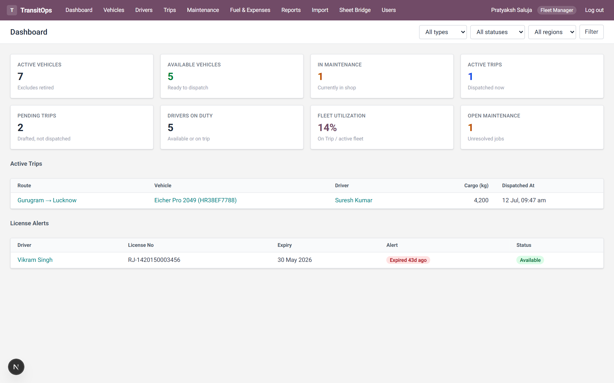
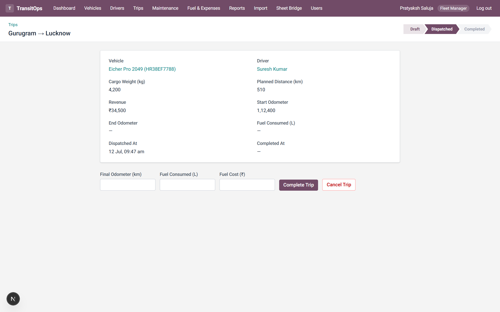
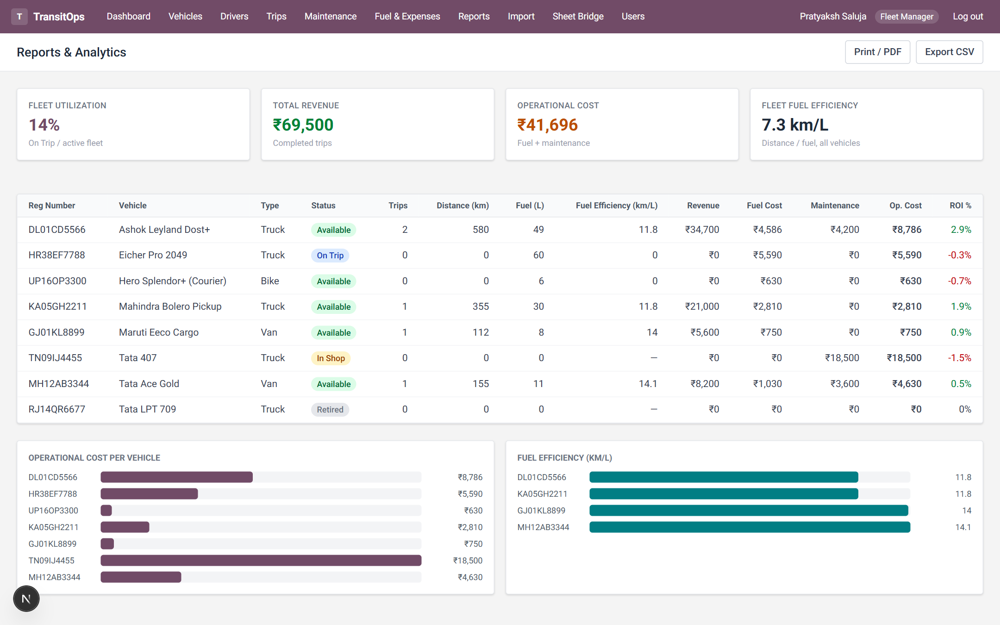
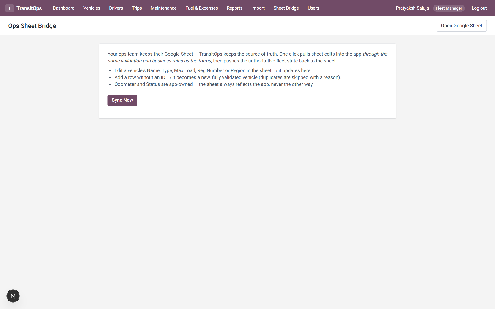
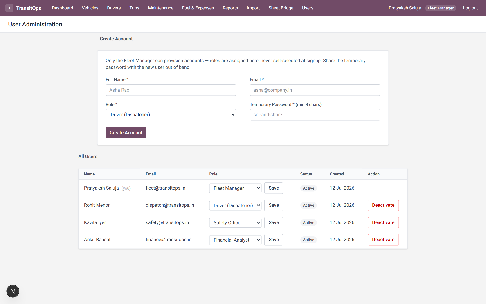

# TransitOps — Smart Transport Operations Platform

A centralized platform to manage the complete lifecycle of transport operations: vehicle registration, driver management, trip dispatching, maintenance, fuel & expense tracking, and operational analytics — with every business rule enforced server-side.

Built for the Odoo Hackathon 2026 (TransitOps problem statement).

## Quick start

```bash
npm install        # installs deps + generates the Prisma client
npm run setup      # creates the SQLite database and seeds demo data
npm run dev        # http://localhost:3000
```

No database server, no environment variables — the app runs on a local SQLite file.

### Demo logins (password for all: `demo1234`)

| Role | Email | What they do |
|---|---|---|
| Fleet Manager | `fleet@transitops.in` | Vehicles, maintenance, full oversight |
| Driver (Dispatcher) | `dispatch@transitops.in` | Creates and dispatches trips |
| Safety Officer | `safety@transitops.in` | Driver compliance, licenses, suspensions |
| Financial Analyst | `finance@transitops.in` | Fuel & expense logs, reports |

Role-based access control: every mutation is guarded server-side (see `lib/session.ts` → `assertRole`); the Fleet Manager has cross-module oversight.

## Screenshots

| Dashboard | Trip pipeline |
|---|---|
|  |  |

| Reports & analytics | Ops Sheet Bridge |
|---|---|
|  |  |

| User administration (Fleet Manager only) |
|---|
|  |

## Stack

- **Next.js (App Router) + TypeScript** — server components + server actions, no client-side API juggling
- **Prisma + SQLite** — zero-setup relational store; schema in `prisma/schema.prisma`
- **Zod** — every form/CSV boundary is validated before it touches a service
- **Tailwind CSS** — UI styled after the Odoo backend (plum navbar, list/form views, chevron status pipeline)

Architecture: pages and server actions never contain business logic — they parse input (Zod), check the session role, and call a **service layer** (`lib/services/`). All status transitions run inside Prisma transactions so a vehicle, its driver, and the trip can never disagree.

## Deployment

Set environment variables from `.env.example` on the host — most importantly **`SESSION_SECRET`** (a random 32+ char string; the app refuses to boot in production without it). Sessions use `secure` cookies automatically when `NODE_ENV=production`, so serve over HTTPS.

```bash
npm install
npm run setup     # prisma db push + seed
npm run build
npm start
```

The datastore is a local **SQLite file**, so deploy to a host with a **persistent filesystem** (Render, Railway, Fly, a VPS, or a container with a mounted volume) rather than an ephemeral serverless runtime. To move to Postgres, change the `datasource` provider in `prisma/schema.prisma` and set `DATABASE_URL` — no application code changes are required (all access goes through the service layer).

Accounts are provisioned by the Fleet Manager in-app (Users screen); after first deploy, log in with the seeded `fleet@transitops.in` account and create the rest.

## Mandatory business rules — where each is enforced

| # | Rule | Enforced in |
|---|---|---|
| 1 | Vehicle registration number must be unique | `lib/services/vehicleService.ts` → `createVehicle`/`updateVehicle` (+ `@unique` DB constraint) |
| 2 | Retired / In-Shop vehicles never appear in dispatch selection | `lib/services/tripService.ts` → `dispatchableVehicles` (UI pool) + `validateAssignment` (server re-check) |
| 3 | Expired-license or Suspended drivers cannot be assigned | `tripService.ts` → `assignableDrivers` + `validateAssignment` |
| 4 | A driver/vehicle already On Trip cannot take another trip | `tripService.ts` → `validateAssignment` |
| 5 | Cargo weight must not exceed the vehicle's max load capacity | `tripService.ts` → `validateAssignment` |
| 6 | Dispatching flips vehicle + driver to On Trip | `tripService.ts` → `dispatchTrip` (single transaction) |
| 7 | Completing a trip restores both to Available | `tripService.ts` → `completeTrip` (also records final odometer + fuel log) |
| 8 | Cancelling a dispatched trip restores both to Available | `tripService.ts` → `cancelTrip` |
| 9 | Opening maintenance moves the vehicle to In Shop | `lib/services/maintenanceService.ts` → `openMaintenance` |
| 10 | Closing maintenance restores the vehicle (unless retired) | `maintenanceService.ts` → `closeMaintenance` |

The rules are checked at **draft time and re-checked inside the dispatch transaction**, so stale drafts can't sneak past a fleet-state change (e.g. the vehicle went into the shop after the trip was drafted).

## Walkthrough — the spec's example workflow

1. Log in as the Fleet Manager and register vehicle `Van-05` (Vehicles → New) with max capacity 500 kg → status **Available**.
2. Add driver `Alex` with a valid license (Drivers → New, as Safety Officer or Fleet Manager).
3. As the Dispatcher, create a trip with cargo weight 450 kg → allowed (450 ≤ 500). Try 550 kg → blocked with the capacity message.
4. Dispatch the trip → vehicle and driver both flip to **On Trip** (check Vehicles/Drivers lists).
5. Complete the trip entering the final odometer and fuel consumed → both return to **Available**, the vehicle odometer updates, and a fuel log is created.
6. Open a maintenance log (e.g. Oil Change) on the vehicle → it flips to **In Shop** and disappears from the dispatch pool.
7. Reports update operational cost and fuel efficiency from the new trip and fuel data.

The seed data already contains every state (an active dispatched trip, an expired license, a suspended driver, an in-shop vehicle, a retired vehicle) so the rules can be exercised immediately.

## Modules

- **Dashboard** — live KPIs (active/available/in-maintenance vehicles, active & pending trips, drivers on duty, fleet utilization %) with type/status/region filters, active-trip feed, and license-expiry alerts.
- **Vehicles** — registry with search/filters, full lifecycle (Available / On Trip / In Shop / Retired), per-vehicle trip, maintenance and fuel history.
- **Drivers** — profiles with license category/expiry, safety score, duty status; expired/expiring licenses are flagged inline.
- **Trips** — draft → dispatch → complete/cancel pipeline with an Odoo-style status bar; all ten business rules surface as inline errors, not silent failures.
- **Maintenance** — open/close logs with automatic vehicle status flips.
- **Fuel & Expenses** — fuel logs and other expenses per vehicle, with automatic operational-cost rollups (Fuel + Maintenance).
- **Reports & Analytics** — fuel efficiency (km/L), fleet utilization, operational cost and vehicle ROI `((Revenue − (Maintenance + Fuel)) / Acquisition Cost)`, CSV export, and cost/efficiency charts.
- **User Administration** (Fleet Manager only) — provision accounts, assign/change roles, and deactivate users. Signup is closed and roles are never self-assigned; the app is protected from lockout (you can't deactivate yourself or demote/deactivate the last active Fleet Manager). Deactivated users cannot log in.
- **Spreadsheet Import** — the migration path for teams still on Excel: upload an existing vehicle/driver logbook as CSV; every row passes through the same validation and duplicate rules as the forms, with a per-row created/skipped report. Sample files included.
- **Ops Sheet Bridge** — two-way Google Sheets sync for teams that won't leave their sheet. One click pulls sheet edits into the app *through the same validation and business rules as the forms* (a new sheet row becomes a validated vehicle, duplicates are skipped with a reason), then pushes the authoritative fleet state back, stamping IDs onto new rows. Pull-then-push in a single pass means no echo loops; Odometer and Status stay app-owned. Config is optional and env-based (`GOOGLE_OAUTH_CLIENT_PATH`, `GOOGLE_SHEETS_TOKEN_PATH`, `SYNC_SPREADSHEET_ID` in `.env.local` — an OAuth client + token JSON with the `spreadsheets` scope); without it the rest of the app is fully functional and the `/sync` page explains the feature.

## Notes

- Trip revenue is captured per trip to power the ROI report.
- Signup is intentionally closed: accounts are provisioned by the Fleet Manager (Users screen) and roles are never self-assigned.
- `npm run seed` is idempotent — it resets to a clean demo state.
